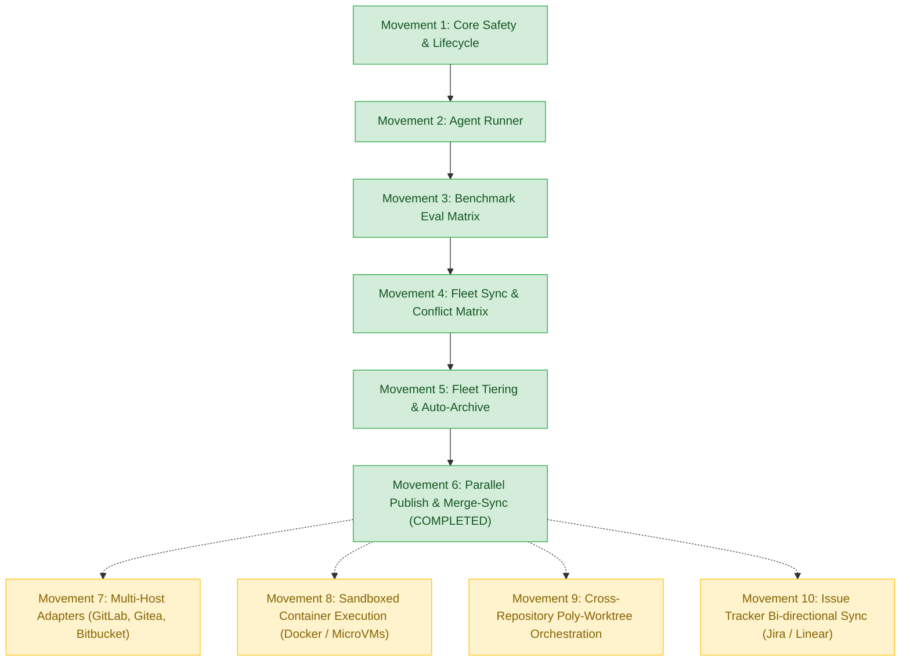

# Session Handoff & Roadmap Status

> **Date:** 2026-09-01  
> **Maintainer:** Gabor Szabo `<gabor@stp72.com>`  
> **Current Milestone:** **Movement 6 Complete & Pushed** (`006-parallel-publish-merge-sync` commit `1414f3e`)  
> **Quality Gate:** 100% Green (51/51 test suites, 122/122 tests passing, 0 lint errors)

---

## 1. Executive Summary & Status

We just completed and pushed **Movement 6: Parallel Publish & Multi-Branch Merge-Sync** (`006-parallel-publish-merge-sync`). 

All core foundation and advanced multi-worktree orchestration capabilities (Movements 1 through 6) are 100% implemented, tested, and verified against strict quality gates and anti-regression protocols.

---

## 2. Complete Movement Lifecycle Map



---

## 3. Completed Movements (100% Done & Pushed)

| Movement | Branch & Commit | Core Deliverables | Verification Status |
| :--- | :--- | :--- | :--- |
| **Movement 1: Core Safety & Worktree Lifecycle** | `001-safety-lifecycle-recovery` | Explicit base resolution, isolated workspace lifecycle (`spawn`, `drop`, `list`, `info`, `status`, `sync`), setup & env profiles, `doctor`, transactional journal rollback, and workspace `archive`/`restore`. | ✅ **PASS** |
| **Movement 2: Agent Contract Runner** | `002-agent-contract-runner` | Autonomous worker agent orchestration (`agent dispatch`, `agent status`, `agent verify`, `agent cancel`), `.task/task-contract.md` parsing, quality gates, and fulfillment verification. | ✅ **PASS** |
| **Movement 3: Benchmark Matrix Evaluation** | `003-benchmark-matrix-eval` | Automated multi-variant benchmark harness (`parallel eval`), probe matrices, baseline delta sampling, and Weighted Sum Model (WSM) composite scoring. | ✅ **PASS** |
| **Movement 4: Fleet Sync & Conflict Matrix** | `004-fleet-sync-conflict-matrix` | Fleet-wide synchronization (`fleet sync`), in-memory 3-way merge simulation, and pairwise $N \times N$ cross-worktree collision matrix (`fleet conflict-matrix`). | ✅ **PASS** |
| **Movement 5: Fleet Tiering & Auto-Archive** | `005-fleet-tier-auto-archive` | Concurrency leases (`fleet lease`), lifecycle tiers (`hot`/`warm`/`cold`/`pinned`), automated retention auto-archival (`fleet auto-archive`), and capacity status dashboard (`fleet status`). | ✅ **PASS** |
| **Movement 6: Parallel Publish & Merge-Sync** | `006-parallel-publish-merge-sync`<br>(`1414f3e`) | Single-command parallel winner PR publishing with embedded benchmark matrix (`parallel publish`), multi-branch release assembly (`fleet merge-sync`), release manifests, and fleet batch publishing (`fleet publish`). | ✅ **PASS** |

---

## 4. Remaining Planned Movements (Next Roadmap Steps)

The following 4 advanced movements are queued for the next iterations:

### 🚀 Movement 7: Multi-Host Adapters (GitLab, Gitea, Bitbucket)
- **Goal:** Extend beyond GitHub CLI (`gh`) to provide native API and CLI publishing adapters for GitLab Merge Requests, Gitea Pull Requests, and Bitbucket Cloud/Server.
- **Key Modules:** `src/adapters/gitlab.ts`, `src/adapters/gitea.ts`, `src/adapters/bitbucket.ts`, host auto-detection, and token credential resolution.

### 🛡️ Movement 8: Sandboxed Container Execution (Docker / MicroVMs)
- **Goal:** Isolate autonomous agent execution and benchmark probe evaluation in lightweight containerized environments (Docker / Firecracker MicroVMs) to prevent uncontrolled filesystem access or side-effects.
- **Key Modules:** `src/runtime/docker.ts`, `src/runtime/sandbox.ts`, resource constraints (CPU/RAM limits), and bind-mount worktree security.

### 🌐 Movement 9: Cross-Repository Poly-Worktree Orchestration
- **Goal:** Orchestrate synchronized, parallel worktrees across multiple repositories (poly-repo / microservices) with coordinated base-branch resolution and atomic cross-repo commits.
- **Key Modules:** `.mannostree.fleet.yml`, `src/poly/orchestrator.ts`, cross-repo dependency DAG resolution, and multi-repo merge-sync.

### 📊 Movement 10: Issue Tracker Bi-Directional Sync (Jira / Linear)
- **Goal:** Full bi-directional status synchronization with external issue trackers (Jira, Linear, GitHub Projects), automatically updating issue states as worktrees progress through lifecycle states (`WORKTREE_READY` $\to$ `IMPLEMENTED` $\to$ `PR_OPEN`).
- **Key Modules:** `src/integrations/jira.ts`, `src/integrations/linear.ts`, webhook listeners, and acceptance criteria auto-population.

---

## 5. Verification Commands

```bash
# Full test suite (51 files, 122 tests)
npm test

# Strict TypeScript typechecking and linting
npm run lint

# Check git status
git status
```
