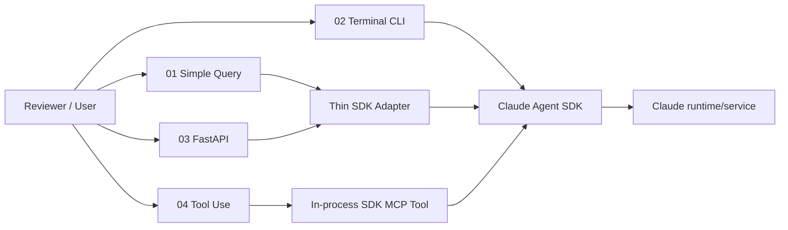

# Claude Agent SDK Engineering Lab

> A compact, evidence-first Python repository demonstrating real application-level use of the **Claude Agent SDK** through stateless queries, interactive sessions, custom tools/MCP, async control flow, and a typed FastAPI boundary.

[](https://github.com/w7-mgfcode/claude-agent-sdk-engineering-lab/actions/workflows/ci.yml)
[](https://www.python.org/)
[](https://pypi.org/project/claude-agent-sdk/)
[](https://fastapi.tiangolo.com/)
[](https://mypy-lang.org/)
[](https://github.com/astral-sh/ruff)
[](https://opensource.org/licenses/MIT)

## Why this repo exists

This repository is intentionally small. Its purpose is not to build another generic agent platform; it is to make specific AI-engineering skills easy to verify from source code.

It demonstrates:

- **Claude Agent SDK** `query()` for one-shot/stateless execution.
- **ClaudeSDKClient** for stateful, multi-turn interaction and session resume.
- Meaningful **async Python**: async iterators, context-managed client lifecycle, timeout, interruption and cancellation-aware control flow.
- A harmless **custom tool** registered through an in-process SDK MCP server.
- A typed **FastAPI** `/v1/chat/completions` compatibility subset around the Agent SDK.
- Dependency injection, explicit error mapping, tests, CI, safe defaults, and evidence-oriented documentation.

The implementation is inspired by the learning progression in the Dynamous Claude Agent SDK workshop examples, but the structure, adapter layer, API contract, tests, safety controls, and evidence documentation here are original.

## 2-minute reviewer path

If you are reviewing this repository for an AI Engineer role, inspect these files in order:

1. [`examples/01_simple_query.py`](examples/01_simple_query.py) — smallest real `query()` call.
2. [`examples/02_terminal_cli.py`](examples/02_terminal_cli.py) — `ClaudeSDKClient`, multi-turn lifecycle, timeout, resume.
3. [`src/claude_agent_lab/tools/project_facts.py`](src/claude_agent_lab/tools/project_facts.py) + [`examples/04_tool_use.py`](examples/04_tool_use.py) — custom Agent SDK tool via in-process MCP.
4. [`src/claude_agent_lab/api.py`](src/claude_agent_lab/api.py) — typed FastAPI boundary and error mapping.
5. [`src/claude_agent_lab/tools/tool_policy.py`](src/claude_agent_lab/tools/tool_policy.py) + [`examples/05_permission_hook.py`](examples/05_permission_hook.py) — deterministic PreToolUse permission hook.
6. [`tests/`](tests/) and [`docs/EVIDENCE.md`](docs/EVIDENCE.md) — what is verified and what is deliberately not claimed.

## Learning path

### 01 — Simple Query

Single stateless query using `claude_agent_sdk.query()`.

```bash
uv run python examples/01_simple_query.py \
  "Explain asyncio.gather vs TaskGroup in three bullets."
```

### 02 — Terminal CLI

Interactive multi-turn session using `ClaudeSDKClient`.

```bash
uv run python examples/02_terminal_cli.py
```

Commands inside the CLI:

- `/help` — show commands
- `/session` — show current session ID
- `/new` — close the current SDK client and start a fresh session
- `/exit` — quit cleanly

Resume the last stored session metadata:

```bash
uv run python examples/02_terminal_cli.py --resume last
```

> Session resume is delegated to the Claude Agent SDK. This repository stores only non-secret convenience metadata (session ID + working directory), not credentials or full transcripts.

### 03 — OpenAI-shaped FastAPI endpoint

Start the server:

```bash
uv run python examples/03_api_server.py
```

Health:

```bash
curl http://127.0.0.1:8000/health
```

Chat completion subset:

```bash
curl -s http://127.0.0.1:8000/v1/chat/completions \
  -H 'content-type: application/json' \
  -d '{
    "model": "claude-sonnet-4-6",
    "messages": [
      {"role": "user", "content": "Explain async iterators in Python."}
    ]
  }'
```

This is an **OpenAI-compatible shape for a deliberately small implemented subset**. It is not a claim of full OpenAI protocol compatibility. Streaming and temperature are rejected in v1 rather than silently ignored.

### 04 — Custom tool / SDK MCP

A deterministic read-only tool exposes facts about this repository to the agent.

```bash
uv run python examples/04_tool_use.py
```

The example uses:

- `@tool(...)`
- `create_sdk_mcp_server(...)`
- `ClaudeSDKClient`
- a narrow `allowed_tools` list

No Bash or unrestricted filesystem-write permission is enabled by default.

### 05 — Permission hook

A `PreToolUse` hook enforces a deterministic allow/deny policy independently of `allowed_tools`, and prints its decision for every tool-use attempt.

```bash
uv run python examples/05_permission_hook.py
```

The example uses:

- `ClaudeAgentOptions.hooks` + `HookMatcher`
- `src/claude_agent_lab/tools/tool_policy.py::evaluate_tool_use` — pure, deterministic policy logic, unit-tested without live SDK credentials
- `src/claude_agent_lab/tools/tool_policy.py::build_pre_tool_use_hook` — adapts that policy into the Agent SDK's hook callback shape

## Setup

### Prerequisites

- Python 3.11+
- [`uv`](https://docs.astral.sh/uv/)
- a working Claude Agent SDK / Claude Code authentication context

The repository pins `claude-agent-sdk==0.2.134` because the goal is a reproducible, reviewable demonstration. Upgrade deliberately and rerun the verification gates when changing the SDK version.

```bash
git clone https://github.com/w7-mgfcode/claude-agent-sdk-engineering-lab.git
cd claude-agent-sdk-engineering-lab
cp .env.example .env
uv sync --all-groups
```

The starter ZIP intentionally does not ship a hand-written `uv.lock`; the first successful `uv sync`/`uv lock` on a networked development machine should generate it, after which it should be committed for reproducible CI.

Authentication is intentionally **not** hard-coded into this repo. Use a supported Claude Agent SDK / Claude Code authentication method for your environment. Never commit credentials.

## Configuration

| Variable | Default | Purpose |
|---|---:|---|
| `LAB_CLAUDE_MODEL` | SDK default | Optional Claude model override |
| `LAB_TURN_TIMEOUT_SECONDS` | `90` | Bound one turn/request |
| `LAB_MAX_TURNS` | `4` | Bound agent turns |
| `LAB_MAX_BUDGET_USD` | `0.25` | Cost guard for demo calls |
| `LAB_LOG_LEVEL` | `INFO` | Local log level |
| `RUN_LIVE_CLAUDE_TESTS` | `0` | Opt in to live smoke test |

## Verification

Credential-free gates:

```bash
make verify
```

See [AGENTS.md](AGENTS.md) for canonical agent instructions, quality gates, and project conventions.

Equivalent commands:

```bash
uv run ruff check .
uv run ruff format --check .
uv run mypy src examples tests
uv run pytest
```

Optional live smoke test:

```bash
RUN_LIVE_CLAUDE_TESTS=1 uv run pytest -m live tests/live/test_sdk_smoke.py
```

## Architecture



The adapter intentionally stays thin: reviewers should still be able to see where `query()`, `ClaudeAgentOptions`, and `ClaudeSDKClient` are used.

## Security posture

- no credentials in Git;
- no `bypassPermissions` default;
- no Bash tool enabled by default;
- no unrestricted filesystem writes;
- demo MCP tool is deterministic and read-only;
- API errors do not expose raw stack traces;
- prompts are not logged by default;
- live tests are opt-in.

See [`docs/SECURITY.md`](docs/SECURITY.md).

## Evidence map

See [`docs/EVIDENCE.md`](docs/EVIDENCE.md) for exact claim → file/function mappings and [`docs/JOB_OFFER_FIT.md`](docs/JOB_OFFER_FIT.md) for the recruiter-oriented interpretation.

## What this repo does **not** claim

This repository does **not** claim enterprise-scale production operation, high availability, full OpenAI API compatibility, LangGraph usage, Codex SDK usage, or Milvus/Qdrant/Weaviate experience. It demonstrates the technologies actually present in its source code.

## Development status

The ZIP starter is designed as a strong **first commit**, not as a fake finished project. The main runtime paths are scaffolded and test seams are present; you should run the live examples, capture sample outputs, then iterate through the roadmap in [`docs/ROADMAP.md`](docs/ROADMAP.md).

## License and inspiration

MIT licensed. Learning-flow inspiration: Dynamous Community's Claude Agent SDK workshop. This repository is an independent implementation and extension for engineering evidence.
