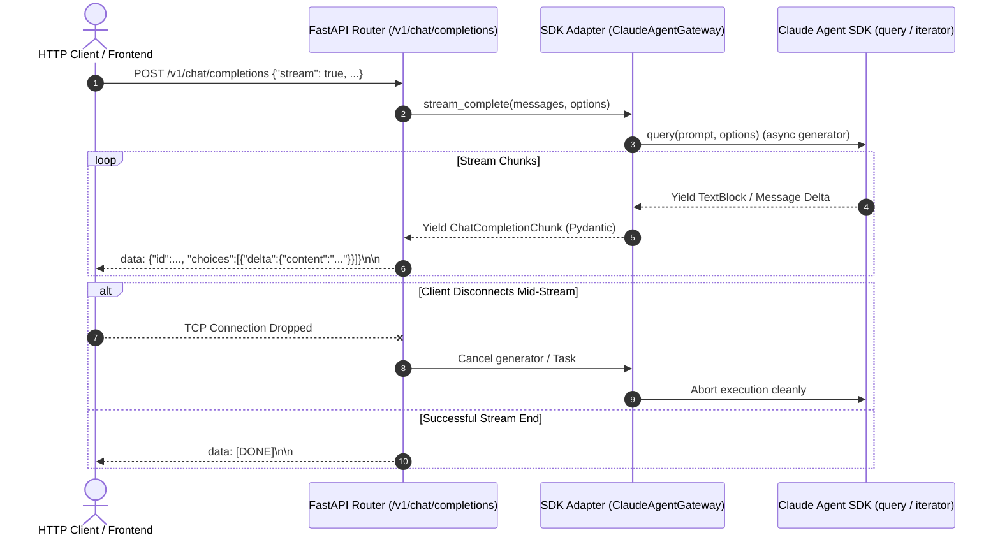

# Movement 02 — SSE Streaming & Async Task Cancellation Boundary

## Objective

Implement real-time Server-Sent Events (SSE) streaming on the FastAPI `/v1/chat/completions` endpoint (`stream: true`), coupled with graceful client-disconnect task cancellation to prevent compute and token waste.

---

## Architectural Flow

---

## Implementation Tasks

### 1. Schema & Request Models
- Update `ChatCompletionRequest` in [src/claude_agent_lab/api_models.py](../../src/claude_agent_lab/api_models.py):
  - Allow `stream: bool = False`.
  - Add `ChatCompletionChunk` and `ChatCompletionChunkChoice` models matching OpenAI streaming chunk specs.

### 2. Adapter Streaming Method
- Add `stream_complete()` method in [src/claude_agent_lab/sdk_adapter.py](../../src/claude_agent_lab/sdk_adapter.py):
  - Consumes SDK async message stream.
  - Yields structured text delta tokens.
  - Handles `asyncio.CancelledError` gracefully.

### 3. FastAPI SSE Endpoint with Disconnect Detection
- Update [src/claude_agent_lab/api.py](../../src/claude_agent_lab/api.py):
  - Return `StreamingResponse(..., media_type="text/event-stream")` when `stream=True`.
  - Monitor `request.is_disconnected()` in the streaming generator loop to trigger immediate SDK task cancellation.

### 4. Fake Gateway & Test Suite
- Expand `FakeClaudeGateway` in [tests/integration/test_api_fake_sdk.py](../../tests/integration/test_api_fake_sdk.py):
  - Implement async stream generator mock.
  - Add integration tests verifying chunk structure, `[DONE]` terminator, and simulated disconnect cancellation.

---

## Definition of Done

- [ ] `POST /v1/chat/completions` with `"stream": true` returns valid SSE chunks.
- [ ] Dropping client connection aborts active background async tasks immediately.
- [ ] Integration tests in `tests/integration/test_api_fake_sdk.py` verify full streaming and cancellation paths.
- [ ] `make verify` passes with strict typing and no linter warnings.
