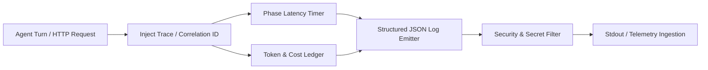

# Movement 04 — Structured Telemetry, Cost Ledger & Turn Metrics

## Objective

Equip the engineering lab with production-ready observability: structured JSON logging, execution phase latency measurement, and granular token/cost accounting while strictly safeguarding secrets and private prompt data.

---

## Observability Architecture



---

## Implementation Tasks

### 1. Phase Latency Instrumentation
- Enhance [src/claude_agent_lab/logging_utils.py](../../src/claude_agent_lab/logging_utils.py):
  - Track elapsed milliseconds across distinct lifecycle stages:
    1. *Request validation & adapter initialization*
    2. *SDK model thinking / generation*
    3. *MCP tool execution*
    4. *Response serialization*

### 2. Token & Cost Accounting Engine
- Add a lightweight cost calculator in `src/claude_agent_lab/cost_ledger.py`:
  - Calculate estimated USD spend based on model-specific input/output token rates.
  - Enforce hard cutoff against `LAB_MAX_BUDGET_USD` configured in [src/claude_agent_lab/config.py](../../src/claude_agent_lab/config.py).
  - Include token count and estimated cost metadata in API responses (`usage` object).

### 3. Structured JSON Logging Format
- Emit machine-parseable log entries with standard fields:
  ```json
  {
    "timestamp": "2026-09-01T07:35:00Z",
    "level": "INFO",
    "trace_id": "req-9a8f2c",
    "turn_id": 1,
    "model": "claude-sonnet-4-6",
    "duration_ms": 1420,
    "tokens": {"input": 128, "output": 64},
    "cost_usd": 0.00134,
    "event": "turn_completed"
  }
  ```

### 4. Privacy & Sanitization Gate
- Ensure no raw API keys, Authorization headers, or full prompt text are written to log streams by default.

---

## Definition of Done

- [ ] Every request emits a structured JSON log line with trace correlation and phase timing.
- [ ] Token usage and estimated cost are calculated and tracked against configured budget limits.
- [ ] Unit tests in `tests/unit/test_cost_ledger.py` verify token pricing calculation and threshold enforcement.
- [ ] Zero secrets or private prompt content are leaked in logs.
- [ ] `make verify` passes cleanly.
