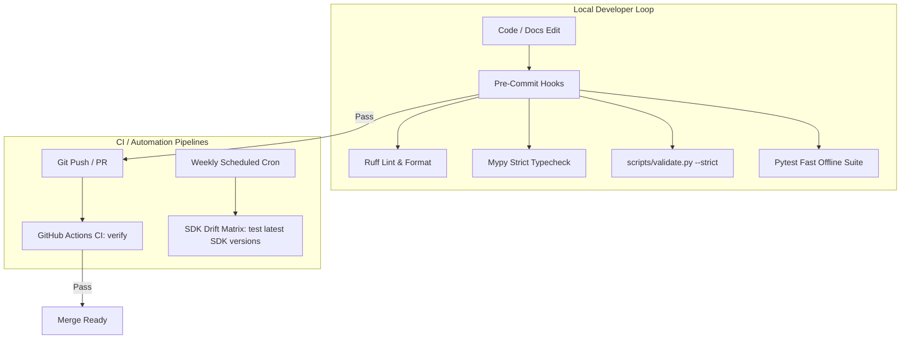

# Movement 05 — Continuous Quality, Pre-Commit & Drift Defense

## Objective

Establish automated defenses against code degradation, documentation drift, and upstream Claude Agent SDK breaking changes.

---

## Defense Workflow

---

## Implementation Tasks

### 1. Pre-Commit Configuration
- Create `.pre-commit-config.yaml`:
  - Hook for `ruff` (lint & format check).
  - Hook for `mypy`.
  - Hook for `.agents/skills/maintaining-agent-docs/scripts/validate.py --strict`.
  - Hook for `pytest` offline unit tests.

### 2. Upstream SDK Drift CI Pipeline
- Create `.github/workflows/sdk-drift.yml`:
  - Runs on a weekly schedule (`cron`).
  - Attempts unpinned / latest `claude-agent-sdk` installation and runs full typecheck + test suite.
  - Opens an issue automatically if upstream breaking API changes occur.

### 3. Packaging & Distribution Check
- Ensure `uv build` produces valid wheel and sdist distributions from `src/claude_agent_lab`.
- Test importing the built package in a clean isolated virtual environment.

---

## Definition of Done

- [ ] `.pre-commit-config.yaml` is active and passing on all repository files.
- [ ] Upstream SDK drift workflow is established in GitHub Actions.
- [ ] Package build succeeds via `uv build`.
- [ ] `make verify` passes with zero warnings.
