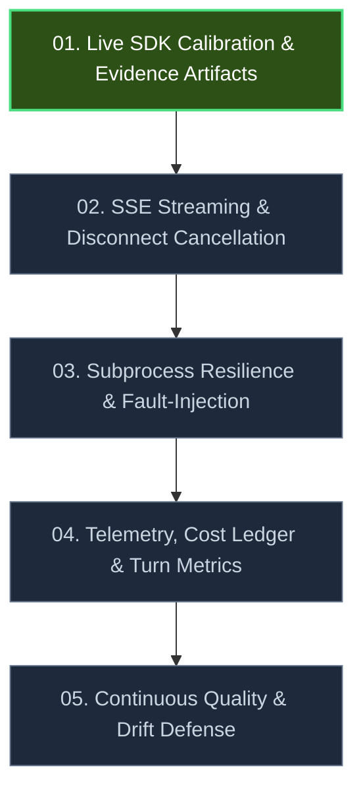

# Continuous Development Movements

This directory outlines the structured execution plan for advancing the **Claude Agent SDK Engineering Lab** from a validated starter into an evidence-first engineering benchmark.

---

## Strategic Roadmap

---

## Movement Matrix

| Movement | Focus Area | Core Deliverables | Target Artifacts |
| :--- | :--- | :--- | :--- |
| [**01. Live SDK Calibration**](01_live_sdk_calibration.md) | Grounded Proof | Run live examples, verify session resume, capture sanitized transcripts. | `docs/EVIDENCE.md` `docs/DEMO_SCRIPT.md` `docs/TROUBLESHOOTING.md` |
| [**02. SSE Streaming & Cancellation**](02_sse_streaming_cancellation.md) | Async Architecture | Add `stream: true` to FastAPI endpoint with client-disconnect task cancellation. | `src/claude_agent_lab/api.py` `src/claude_agent_lab/sdk_adapter.py` `tests/integration/test_api_fake_sdk.py` |
| [**03. Resilience & Fault-Injection**](03_resilience_fault_injection.md) | Edge-Case Robustness | Chaos tests: timeouts, MCP exceptions, hook denials, malformed payloads. | `tests/unit/test_resilience.py` `src/claude_agent_lab/errors.py` |
| [**04. Telemetry & Cost Accounting**](04_telemetry_cost_ledger.md) | Observability | Structured JSON tracing, phase latency metrics, token/USD budget enforcement. | `src/claude_agent_lab/logging_utils.py` `src/claude_agent_lab/config.py` |
| [**05. Quality & Drift Defense**](05_continuous_quality_drift.md) | Automation | Pre-commit hooks, upstream SDK drift monitoring CI, packaging verification. | `.pre-commit-config.yaml` `.github/workflows/sdk-drift.yml` |

---

## Execution Principles

1. **Evidence-First**: Never claim a capability in documentation without inspectable code and reproducible test results.
2. **Deterministic Quality Gates**: Every movement must maintain 100% pass rate on `make verify` (Ruff lint/formatting, Mypy strict mode, Pytest offline suite).
3. **Zero Security Regressions**: Never log raw prompts, secrets, or bypass security defaults (see [docs/SECURITY.md](../SECURITY.md)).
4. **Clean File Boundaries**: Keep thin shims ([CLAUDE.md](../../CLAUDE.md), [GEMINI.md](../../GEMINI.md)) importing from canonical [AGENTS.md](../../AGENTS.md).
