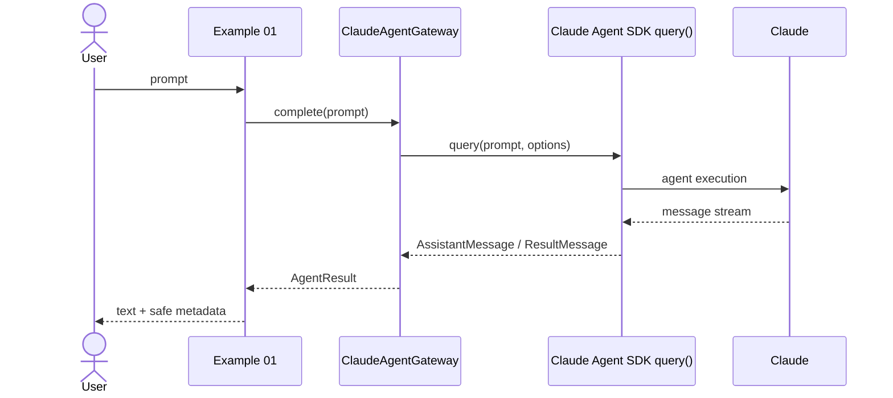
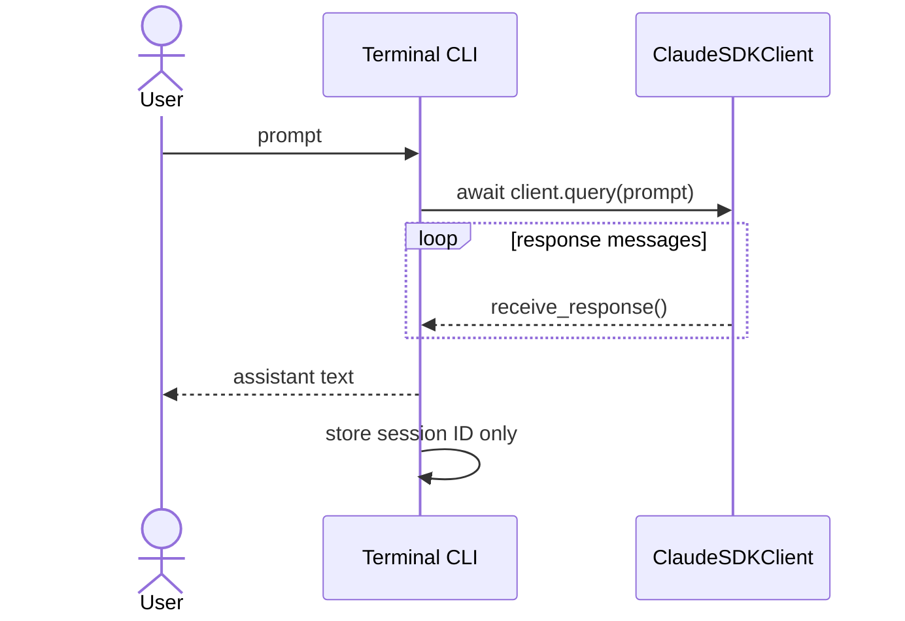

# Architecture

## Design objective

Keep Claude Agent SDK integration visible while still showing application engineering around it.

## Boundaries

### Example/application layer
Owns CLI UX, HTTP validation, timeout policy, dependency injection, local non-secret session metadata, and stable error responses.

### Claude Agent SDK layer
Owns the agent protocol, `query()`/`ClaudeSDKClient`, SDK messages, session semantics exposed by the SDK, and MCP/tool dispatch integration.

### Claude runtime/service
Owns model inference and provider-side behavior.

## Runtime flows

### One shot

### Interactive session

### FastAPI

The HTTP layer depends on a `CompletionGateway` protocol. Production runtime resolves it to `ClaudeAgentGateway`; tests override it with deterministic fakes. This demonstrates dependency injection without hiding the actual SDK implementation.

## OpenAI compatibility boundary

The server supports only:

- one request endpoint: `POST /v1/chat/completions`;
- roles: system/user/assistant;
- non-streaming response;
- one assistant choice;
- model passed through to the SDK;
- optional cost/turn metadata when trustworthy.

`stream=true` and `temperature` are rejected in v1 rather than ignored.
