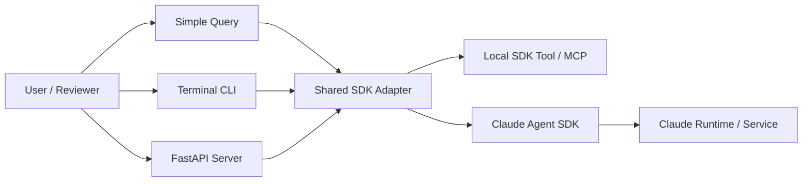

# PRD — Claude Agent SDK Engineering Lab

> A small, evidence-first public GitHub repository that demonstrates real application-level use of the Claude Agent SDK for Python through three progressively richer examples: a stateless query, a persistent terminal session, and an OpenAI-compatible FastAPI server. The repository is inspired by the Dynamous Claude Agent SDK workshop examples, but the implementation, tests, documentation, and engineering controls are original.

**Status:** Draft for implementation  
**Version:** 1.0  
**Date:** 2026-08-28  
**Working repository name:** `claude-agent-sdk-engineering-lab`

---

## 1. What it is

Claude Agent SDK Engineering Lab is a compact, recruiter-friendly Python repository whose primary purpose is to provide concrete, inspectable evidence that the author can integrate the **Claude Agent SDK** into real Python application boundaries. It deliberately avoids becoming a large product. Instead, it presents three increasingly realistic examples that share a small common SDK adapter layer, typed contracts, structured logging, tests, safe defaults, and reproducible setup.

The repository should be understandable in three modes:

1. **2-minute recruiter scan:** README, architecture, screenshots / sample output, CI badge, exact evidence map.
2. **10-minute technical review:** inspect the three examples, shared SDK adapter, tests, and session handling.
3. **30–60 minute hands-on run:** install, configure authentication, run all examples, execute tests, and inspect failure behavior.

The project exists to prove implementation experience, not to claim production scale or commercial deployment.

## 2. Why this repository exists

The immediate portfolio goal is to close a specific evidence gap: current GitHub work strongly demonstrates FastAPI, async Python, Pydantic AI, pgvector, and RAG, but does not yet contain a direct runtime implementation using the Claude Agent SDK. The repo therefore needs to make the following claim technically defensible:

> “I have built Python applications with the Claude Agent SDK, including stateless queries, interactive persistent sessions, custom tool integration, async streaming, and a FastAPI/OpenAI-compatible API boundary.”

The repository must make that claim verifiable from source code rather than README wording alone. This follows the existing evidence-first portfolio rule: implementation evidence takes precedence over descriptions or marketing claims.

## 3. Users and jobs

### 3.1 Primary users

- **AI Engineer hiring manager** — wants to verify actual Claude Agent SDK usage and engineering depth.
- **Technical recruiter** — wants a fast yes/no signal for named framework experience.
- **Python / LLM engineer reviewer** — wants to inspect async behavior, API boundaries, tool configuration, session lifecycle, and tests.
- **Developer learner** — wants three minimal examples that progress from simple to realistic.
- **Repository author** — wants a reusable reference implementation and interview demonstration asset.

### 3.2 Jobs to be done

- Verify that the repository imports and executes `claude_agent_sdk`, not merely the Anthropic REST SDK.
- Understand the difference between `query()` and `ClaudeSDKClient` through working code.
- Observe session persistence/resume behavior in an interactive CLI.
- Call Claude Agent SDK through an HTTP API using an OpenAI-shaped request/response contract.
- Inspect custom tool / SDK MCP integration without unsafe blanket permissions.
- Run automated tests without requiring live paid API calls for the entire test suite.
- See exactly which source files prove each portfolio claim.

## 4. Product goals

### G1 — Direct Claude Agent SDK evidence
Every primary example must contain or transitively use concrete Claude Agent SDK runtime calls. A reviewer must be able to identify imports, options, client/query invocation, message handling, and error paths.

### G2 — Progressive learning path
The three examples must progress cleanly from the smallest useful invocation to interactive session management to a service boundary.

### G3 — Async Python depth
The repository must show meaningful asynchronous execution: async iterators, context-managed client lifecycle, streaming, cancellation/shutdown handling, timeouts, and non-blocking FastAPI integration where appropriate.

### G4 — Portfolio-grade engineering
The project must include typing, linting, tests, CI, structured configuration, error handling, security notes, and reproducible dependency management.

### G5 — Fast reviewer comprehension
A reviewer should understand the project and find the strongest evidence within 10 minutes without reading every file.

### G6 — Honest scope
The repository must not imply enterprise production operation, high availability, multi-region deployment, or large-scale traffic unless such work is later actually implemented and measured.

## 5. Non-goals / out of scope

The following are explicitly out of scope for v1:

- Building a general-purpose agent platform.
- Multi-agent orchestration.
- RAG or vector databases.
- A web frontend.
- User authentication / account management.
- Billing or quota systems.
- Kubernetes deployment.
- Production-grade distributed session storage.
- A complete OpenAI API clone.
- Benchmark claims against other agent frameworks.
- Copying the Dynamous workshop implementation verbatim.
- Claiming Claude API usage as equivalent to Claude Agent SDK usage.
- Enabling unrestricted filesystem, shell, or network tools by default.

## 6. Core capabilities

### 6.1 Example 01 — Simple Query

**Purpose:** demonstrate the smallest correct stateless Claude Agent SDK call.

Required behavior:

- Use `claude_agent_sdk.query()`.
- Execute from an `async` entrypoint.
- Consume the returned async message stream.
- Extract and print assistant text safely by message/block type.
- Capture result metadata when available.
- Accept a prompt from CLI argument or default example prompt.
- Configure model/options through a typed settings object or environment-backed configuration.
- Return a non-zero exit code on SDK/auth/runtime failure.
- Never silently swallow result errors.

Acceptance example:

```bash
uv run python -m examples.simple_query "Explain the difference between asyncio.gather and TaskGroup in 3 bullets."
```

The source should make `query()` usage obvious within seconds.

### 6.2 Example 02 — Persistent Terminal CLI

**Purpose:** demonstrate a stateful, interactive Claude Agent SDK conversation.

Required behavior:

- Use `ClaudeSDKClient` as the primary runtime abstraction.
- Maintain a multi-turn conversation within an interactive session.
- Support session continuation / resume where supported by the tested SDK version.
- Stream assistant output rather than waiting for a single monolithic response.
- Handle `/exit`, `/help`, and `/new` commands.
- Display or optionally persist the active session identifier.
- Cleanly close the SDK client on normal exit, Ctrl+C, and cancellation.
- Apply an explicit timeout strategy for a turn.
- Surface SDK errors in human-readable form.
- Keep terminal UX minimal; do not add a full TUI dependency in v1.

Optional but recommended:

- `--resume <session-id>` flag.
- `--system-prompt-file` flag.
- small local JSON state file containing only non-secret session metadata.

### 6.3 Example 03 — OpenAI-Compatible FastAPI Server

**Purpose:** demonstrate integration of the Claude Agent SDK behind a typed HTTP application boundary.

Required endpoint:

```text
POST /v1/chat/completions
```

Minimum request shape:

- `model`
- `messages[]` with `role` and `content`
- optional `stream`
- optional `temperature` only if the chosen SDK/API path meaningfully supports it; otherwise reject or document it rather than fake support.

Minimum response shape:

- `id`
- `object = "chat.completion"`
- `created`
- `model`
- `choices[]`
- assistant message content
- finish reason if determinable
- usage only if the SDK response provides trustworthy values

Required engineering behavior:

- FastAPI + Pydantic request/response models.
- Async endpoint and SDK invocation.
- Request correlation ID.
- Structured error mapping.
- Readiness/health endpoint.
- Configurable timeout.
- No global mutable conversation state for the default stateless endpoint.
- Optional session-aware extension can be added under a separate endpoint or header, but must not blur the OpenAI-compatible contract.
- Correct HTTP status codes for validation, auth/config, timeout, and upstream SDK errors.
- OpenAPI docs remain enabled for local demonstration.

Required non-goal:

The server is **OpenAI-compatible in shape for the implemented subset**, not a claim of full protocol compatibility.

### 6.4 Engineering Evidence Extension — Custom SDK Tool / MCP

This is a small cross-cutting capability, not a fourth primary tutorial.

Purpose: make the repository unambiguously demonstrate **agent/tool execution**, not only conversational querying.

Required behavior:

- Define at least one harmless custom tool using the Claude Agent SDK-supported tool/MCP mechanism available in the pinned version.
- Recommended tool: `get_project_facts(topic: str)` returning deterministic local portfolio facts from an in-memory dictionary or fixture.
- Register the tool through the SDK-supported MCP/tool configuration path.
- Demonstrate tool invocation in either the CLI or a dedicated `examples/tool_use.py` proof file.
- Validate tool input.
- Return structured text content.
- Unit test the tool independently from live Claude calls.
- Do not enable Bash, unrestricted filesystem writes, or other destructive capabilities by default.

## 7. Functional requirements

### FR-1 Configuration

The application must load non-secret configuration from environment variables and/or `.env` for local development. `.env` must be gitignored and `.env.example` committed.

Configuration should include:

- model name
- default timeout
- log level
- optional session metadata path
- feature flag for live integration tests

Authentication must follow the supported Claude Agent SDK mechanism for the pinned SDK version. Secrets must never be committed.

### FR-2 Shared SDK adapter

A small shared adapter module should centralize:

- `ClaudeAgentOptions` construction
- safe defaults
- common message-to-text extraction
- result/error normalization
- timeout wrapper where shared
- optional tool/MCP registration

The adapter must remain thin. It must not hide SDK concepts so aggressively that a reviewer cannot see actual Claude Agent SDK usage.

### FR-3 Error behavior

Errors must be classified at least into:

- configuration/authentication error
- SDK/transport error
- timeout
- invalid request/input
- tool execution error
- unexpected internal error

CLI examples must print concise errors to stderr and exit non-zero. API example must convert failures to stable JSON errors.

### FR-4 Logging

Use Python `logging` or a lightweight structured logger. At minimum capture:

- request/turn ID
- example/component
- start/end
- latency
- session ID where safe
- error category

Do not log credentials, full secret-bearing environment variables, or raw private prompts by default.

### FR-5 Reproducible execution

- Python: 3.11+ target unless the implementation has a strong reason to preserve the SDK’s broader 3.10 compatibility.
- Dependency management: `uv` preferred.
- Commit `uv.lock`.
- Record the exact tested `claude-agent-sdk` version in README and lockfile.
- Avoid unbounded `latest` installation instructions.

## 8. Architecture

### 8.1 Logical architecture



### 8.2 Runtime boundaries

**Example code owns:** UX, request validation, timeouts, error mapping, session metadata, safe tool configuration, logging, tests.

**Claude Agent SDK owns:** query/client protocol, message streaming, session semantics exposed by the SDK, tool/MCP dispatch integration, transport to the Claude runtime.

**Claude service/runtime owns:** model inference and provider-side behavior.

The PRD intentionally keeps these boundaries explicit so the portfolio does not claim ownership of functionality supplied by the SDK.

## 9. Proposed repository structure

```text
claude-agent-sdk-engineering-lab/
├── README.md
├── LICENSE
├── pyproject.toml
├── uv.lock
├── .env.example
├── .gitignore
├── Makefile
├── AGENTS.md
├── CLAUDE.md
├── docs/
│   ├── PRD.md
│   ├── ARCHITECTURE.md
│   ├── EVIDENCE.md
│   ├── SECURITY.md
│   ├── TROUBLESHOOTING.md
│   └── interview-notes.md
├── src/
│   └── claude_agent_lab/
│       ├── __init__.py
│       ├── config.py
│       ├── sdk_adapter.py
│       ├── messages.py
│       ├── errors.py
│       ├── logging.py
│       └── tools/
│           ├── __init__.py
│           └── project_facts.py
├── examples/
│   ├── 01_simple_query.py
│   ├── 02_terminal_cli.py
│   ├── 03_api_server.py
│   └── 04_tool_use.py
├── tests/
│   ├── unit/
│   │   ├── test_config.py
│   │   ├── test_messages.py
│   │   ├── test_tools.py
│   │   └── test_api_contract.py
│   ├── integration/
│   │   ├── test_cli_fake_sdk.py
│   │   └── test_api_fake_sdk.py
│   └── live/
│       └── test_sdk_smoke.py
└── .github/
    └── workflows/
        └── ci.yml
```

Naming may be adjusted during implementation, but the separation between reusable code, examples, tests, and evidence documentation should remain.

## 10. API contract

### 10.1 Health

`GET /health`

Response:

```json
{
  "status": "ok",
  "service": "claude-agent-sdk-engineering-lab"
}
```

### 10.2 Chat completions subset

`POST /v1/chat/completions`

Example request:

```json
{
  "model": "configured-claude-model",
  "messages": [
    {"role": "user", "content": "Explain async iterators in Python."}
  ],
  "stream": false
}
```

Example response:

```json
{
  "id": "chatcmpl_<generated-id>",
  "object": "chat.completion",
  "created": 1787900000,
  "model": "configured-claude-model",
  "choices": [
    {
      "index": 0,
      "message": {
        "role": "assistant",
        "content": "..."
      },
      "finish_reason": "stop"
    }
  ]
}
```

The implementation must document all unsupported OpenAI fields rather than silently accepting and ignoring them.

## 11. Session model

The terminal example needs a clear distinction between:

- **process session:** the live `ClaudeSDKClient` context;
- **Claude session identifier:** identifier exposed/supported by the SDK for continuation/resume;
- **local session metadata:** non-secret convenience state saved by this repository.

Rules:

1. Do not invent a persistence mechanism that conflicts with SDK session semantics.
2. Local persistence should store only what is needed to resume or identify a session.
3. Do not persist credentials or entire conversations unless explicitly added as a later feature.
4. On invalid/expired session resume, surface a clear error and allow creation of a new session.

## 12. Async and concurrency requirements

The repository must demonstrate async Python in substance, not only syntax.

Required examples:

- consume SDK `AsyncIterator` messages;
- use `async with ClaudeSDKClient(...)` lifecycle;
- await query/receive operations;
- enforce a per-turn timeout;
- gracefully handle cancellation/KeyboardInterrupt in CLI;
- ensure FastAPI request execution does not call blocking compatibility wrappers around the SDK;
- no unsafe background task that can outlive application shutdown without ownership.

If streaming HTTP support is implemented, the disconnect path must cancel/close upstream work cleanly.

## 13. Security and permission model

The default configuration must be conservative.

### Hard rules

1. No credential committed to Git.
2. No unrestricted shell/Bash tool enabled by default.
3. No blanket filesystem write access enabled by default.
4. Custom demo tools must be deterministic and harmless.
5. If built-in tools are demonstrated, permissions/allowed tools must be explicit and narrowly scoped.
6. Dangerous permission modes must never be the default.
7. API error payloads must not leak secrets or raw internal stack traces.
8. README must explain that the examples execute an agent-capable SDK and that tool permissions should be reviewed before expansion.

## 14. Testing strategy

### 14.1 Test layers

**Unit tests** — no live Claude access.

Test:

- settings parsing;
- message extraction;
- error mapping;
- OpenAI-shaped Pydantic models;
- custom tool validation and result;
- session metadata serialization.

**Integration tests with SDK seam/fake** — no paid call required.

Test:

- CLI multi-turn control flow;
- API request -> adapter -> normalized response;
- timeout mapping;
- malformed SDK messages;
- SDK error result handling;
- shutdown/cancellation behavior where practical.

**Live smoke test** — opt-in only.

- gated by an environment flag such as `RUN_LIVE_CLAUDE_TESTS=1`;
- one minimal query;
- asserts that a non-empty assistant response/result is received;
- never runs automatically on untrusted pull requests;
- may be disabled in public CI unless secrets are explicitly configured.

### 14.2 Quality gates

CI must run:

```bash
uv sync --frozen
ruff check .
ruff format --check .
mypy src examples
pytest -q
```

Target for v1:

- all non-live tests pass;
- no Ruff violations;
- mypy clean on project source/examples;
- API contract tests cover success + validation + timeout + SDK error path;
- test suite does not require Anthropic credentials by default.

## 15. Documentation requirements

### README.md

Must include:

- one-paragraph value proposition;
- “What this proves” section;
- exact three-example learning path;
- architecture diagram;
- setup using `uv`;
- authentication/configuration steps based on the pinned SDK version;
- commands to run all examples;
- sample outputs;
- tests/CI commands;
- security/permissions warning;
- “Evidence map” linking directly to the most relevant files;
- explicit statement: inspired by the Dynamous workshop, implemented independently and extended for engineering evidence.

### docs/EVIDENCE.md

This file is mandatory for the portfolio use case.

Suggested table:

| Claim | Exact evidence | What it proves |
|---|---|---|
| Claude Agent SDK one-shot use | `examples/01_simple_query.py` | `query()` + async message stream |
| Claude Agent SDK stateful client | `examples/02_terminal_cli.py` | `ClaudeSDKClient`, multi-turn lifecycle, resume |
| FastAPI integration | `examples/03_api_server.py` | typed HTTP boundary around SDK |
| Agent tool integration | `src/.../tools/project_facts.py` + registration | SDK tool/MCP execution |
| Async Python | shared adapter + CLI/API | async iterator, context manager, timeout/cancellation |
| Testing | `tests/` | behavior verified without README-only claims |

### docs/ARCHITECTURE.md

Explain boundaries, message flow, sessions, API compatibility subset, and why the adapter remains thin.

### docs/SECURITY.md

Explain credentials, permissions, tools, logging/redaction, and known risks.

## 16. Developer experience

Required commands should be easy to remember:

```bash
make setup
make simple
make cli
make api
make test
make lint
make verify
```

Equivalent `uv run ...` commands must also be documented so the Makefile is convenience, not a hidden dependency.

The project should work on Linux/macOS and, where the pinned SDK supports it, Windows. CI should at minimum validate Linux. Cross-platform expansion is desirable but not required for the first implementation pass.

## 17. Observability

For local development, logs should make the execution path visible without exposing sensitive prompt content.

Minimum fields:

- timestamp
- level
- component
- request/turn ID
- session ID when available
- duration_ms
- outcome
- error category

Optional later enhancement:

- OpenTelemetry tracing if stable and useful in the pinned SDK version.

Do not make experimental telemetry a v1 dependency merely because it exists upstream.

## 18. Performance and reliability expectations

This is a demonstration repository; reliability requirements are intentionally bounded.

- Local server should start without contacting Claude until a request is made, unless SDK initialization requires otherwise.
- Health endpoint should remain cheap.
- A single hung model turn must be bounded by configured timeout.
- CLI shutdown should not leave owned child/client resources running.
- API requests must not share mutable conversation state unless an explicit session mode is being used.
- Retries should be conservative and only applied to clearly transient failures; avoid retrying validation/auth errors.

No throughput or latency SLA is claimed in v1.

## 19. Acceptance criteria

The v1 repository is complete only when all of the following are true:

### SDK evidence

- [ ] `claude-agent-sdk` is a declared and locked dependency.
- [ ] Example 01 uses real `query()` runtime code.
- [ ] Example 02 uses real `ClaudeSDKClient` runtime code.
- [ ] At least one custom SDK tool/MCP integration is present and inspectable.
- [ ] README links directly to all of the above.

### Example behavior

- [ ] Simple query returns/prints assistant text.
- [ ] CLI supports at least two conversational turns in one session.
- [ ] CLI exits gracefully and documents resume behavior.
- [ ] FastAPI endpoint accepts the documented OpenAI-shaped request subset.
- [ ] FastAPI endpoint returns the documented response subset.
- [ ] Validation and timeout failures are tested.

### Engineering quality

- [ ] Configuration is typed.
- [ ] No secrets are committed.
- [ ] Unit/integration tests run without live Claude credentials.
- [ ] Optional live smoke test is isolated and gated.
- [ ] Ruff passes.
- [ ] mypy passes.
- [ ] pytest passes.
- [ ] GitHub Actions CI passes on `main`.
- [ ] `uv.lock` is committed.

### Portfolio usability

- [ ] `docs/EVIDENCE.md` maps claims to exact files/functions.
- [ ] README includes a 2-minute reviewer path.
- [ ] Project explicitly distinguishes Claude Agent SDK from plain Anthropic API usage.
- [ ] Project does not claim production deployment or full OpenAI compatibility.
- [ ] Source attribution/inspiration is clear and non-misleading.

## 20. Milestones

### M0 — Foundation

- initialize repository;
- `pyproject.toml`, uv, package layout;
- configuration/errors/logging;
- CI skeleton;
- documentation skeleton.

**Exit:** `make verify` passes with placeholder tests.

### M1 — Simple Query

- implement Example 01;
- message extraction;
- error normalization;
- unit tests around parsing/normalization.

**Exit:** live manual smoke works and non-live CI remains credential-free.

### M2 — Terminal Session

- implement `ClaudeSDKClient` lifecycle;
- multi-turn loop;
- graceful cancellation;
- resume/session metadata where supported;
- fake-SDK integration tests.

**Exit:** two-turn interaction demonstrated and session behavior documented.

### M3 — Tool/MCP Evidence

- implement harmless local tool;
- register through SDK-supported mechanism;
- demonstrate one tool invocation;
- unit test tool schema/result.

**Exit:** repository contains undeniable agent-tool execution evidence.

### M4 — API Server

- request/response models;
- `/health`;
- `/v1/chat/completions` subset;
- request ID + timeout + error mapping;
- API contract tests.

**Exit:** curl request succeeds against a configured local environment; fake-SDK test suite covers API behavior.

### M5 — Portfolio Hardening

- README reviewer path;
- EVIDENCE.md;
- architecture/security/troubleshooting;
- screenshots/sample output;
- final CI and dependency audit.

**Exit:** a technical reviewer can validate the Claude Agent SDK claim from source in under 10 minutes.

## 21. Recommended implementation decisions

These decisions are recommended unless the pinned SDK version forces a change:

| Area | Decision | Rationale |
|---|---|---|
| Python | 3.11+ | Strong async/typing baseline while remaining broadly deployable |
| Dependency manager | `uv` | Fast, reproducible, lockfile-friendly |
| API | FastAPI | Already aligned with portfolio evidence and recruiter requirement |
| Validation | Pydantic | Explicit contracts and FastAPI-native |
| SDK one-shot | `query()` | Official simple-query abstraction |
| SDK interactive | `ClaudeSDKClient` | Official bidirectional/stateful abstraction |
| Tool demo | SDK MCP/custom tool mechanism | Proves agent capability rather than plain chat |
| Tests | pytest + fakes/seams | CI without mandatory live API spend |
| Lint | Ruff | Simple quality gate |
| Types | mypy | Makes async/contracts easier to audit |
| CI | GitHub Actions | Public, recruiter-visible verification |
| License | MIT | Simple portfolio/open-source usage |

## 22. Evidence and claim policy

The repository should be treated as an auditable portfolio artifact. Every externally useful claim should map to source evidence.

### Safe after v1 completion

- “I have implemented Claude Agent SDK applications in Python.”
- “I have used both the stateless `query()` interface and `ClaudeSDKClient` for interactive sessions.”
- “I have integrated Claude Agent SDK behind a FastAPI boundary.”
- “I have implemented an SDK tool/MCP example with explicit permissions.”
- “I have handled async streaming, timeouts, session lifecycle, and failure mapping around the SDK.”

### Not justified by v1 alone

- “I have operated Claude Agent SDK systems in enterprise production.”
- “I have built a large-scale multi-agent platform.”
- “The API is fully OpenAI compatible.”
- “I have high-throughput or HA operational experience with the SDK.”

## 23. Risks and mitigations

| Risk | Impact | Mitigation |
|---|---|---|
| SDK changes rapidly / alpha status | Examples can break after upstream release | Pin and lock tested version; record version; avoid `latest`; keep thin adapter |
| Authentication differs across environments | Poor onboarding | Verify against official docs for pinned version; document supported path only |
| Live tests consume credentials/cost | CI friction | Default to fake-based tests; opt-in live smoke only |
| “OpenAI-compatible” overclaim | Credibility risk | State “implemented subset”; reject/document unsupported fields |
| Tool permissions become unsafe | Security risk | Harmless custom tool by default; explicit allowlist; no unrestricted Bash |
| Workshop appears copied | Portfolio credibility risk | Original structure/code/tests/docs; attribution; explain extensions |
| Adapter hides SDK usage | Weak evidence | Keep wrapper thin; examples should show or clearly link SDK concepts |
| README claims exceed code | Interview risk | EVIDENCE.md and acceptance criteria enforce source-backed claims |

## 24. Success metrics

The repository is successful when:

- all v1 acceptance criteria pass;
- a new developer can run Example 01 in under 10 minutes after providing required authentication;
- all non-live tests run with no Claude credentials;
- CI is green on `main`;
- a reviewer can locate direct `claude_agent_sdk` runtime usage in under 2 minutes;
- a reviewer can identify `query()`, `ClaudeSDKClient`, FastAPI integration, and custom tool/MCP evidence in under 10 minutes;
- the repo supports a truthful “Claude Agent SDK: yes” answer in a technical screening.

## 25. Future extensions — not v1

Only after v1 is clean:

- streaming SSE response for `/v1/chat/completions`;
- explicit persistent session store adapter;
- richer MCP server example;
- hooks/permissions demonstration;
- OpenTelemetry observability if upstream support is stable;
- Docker image;
- small load/latency experiment;
- comparison page: `query()` vs `ClaudeSDKClient` vs Anthropic REST SDK vs Managed Agents;
- managed-agent migration example if relevant to future roles.

These extensions should never block the small, complete, inspectable v1.

## 26. Source and inspiration notes

This PRD uses the following external references for product/API context:

1. Dynamous Community — Claude Agent SDK Workshop Examples:  
   https://github.com/dynamous-community/workshops/tree/main/claude-agent-sdk
2. Anthropic — Claude Agent SDK for Python repository:  
   https://github.com/anthropics/claude-agent-sdk-python
3. Anthropic Platform documentation — Managed Agents migration, showing the Agent SDK concepts `ClaudeAgentOptions`, `ClaudeSDKClient`, custom tools, and sessions:  
   https://platform.claude.com/docs/en/managed-agents/migration

The implementation must use official Anthropic documentation and the pinned dependency as the source of truth when workshop material and current SDK behavior differ.

---

## 27. Final v1 definition

**V1 is three runnable examples plus one small tool-use proof, all sharing a thin, typed, tested SDK integration layer.** It is intentionally small enough to audit quickly and strong enough that the Claude Agent SDK experience is visible in source code, behavior, tests, and CI rather than existing only as a repository description.
